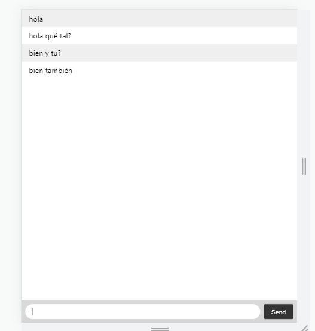

# Chat exercise with websockets

## Technologies
Node.js, Socket.io, html, css

## Webchat with node.js and Socket.io. Users connect to the chat and write messages on a website, the messages are seen by all users who connect

